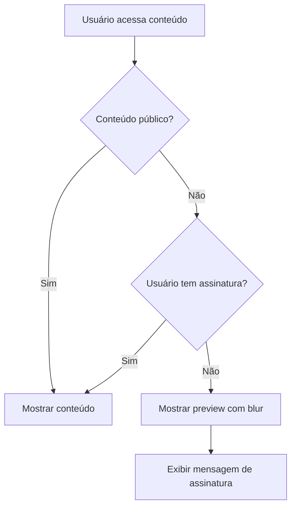

# Sistema de Controle de Visibilidade de Conteúdo

Este documento explica como funciona o sistema de controle de visibilidade implementado no projeto, que permite aos administradores controlarem se o conteúdo é público ou exclusivo para assinantes.

## 🎯 Visão Geral

O sistema permite que administradores marquem arquivos como:
- **Público**: Visível para todos os usuários
- **Assinantes**: Visível apenas para usuários com assinatura ativa

## 📁 Estrutura de Arquivos

### Componentes Principais

1. **ContentProtector** (`src/components/content-protector.tsx`)
   - Componente wrapper que protege conteúdo baseado na visibilidade
   - Mostra mensagem de assinatura necessária para conteúdo protegido

2. **ProtectedMedia** (`src/components/protected-media.tsx`)
   - Componente específico para imagens e vídeos
   - Aplica blur e overlay em conteúdo protegido

3. **ProtectedGallery** (`src/components/protected-gallery.tsx`)
   - Galeria completa com sistema de proteção
   - Filtra automaticamente conteúdo baseado na assinatura do usuário

### Hooks

1. **useContentAccess** (`src/hooks/use-content-access.tsx`)
   - Hook que verifica se o usuário tem acesso a conteúdo de assinantes
   - Retorna informações sobre a assinatura

2. **useSubscription** (`src/hooks/use-subscription.ts`)
   - Hook principal para gerenciar estado de assinatura
   - Verifica periodicamente se a assinatura ainda está ativa

### Utilitários

1. **firebase-storage.ts** (`src/lib/firebase-storage.ts`)
   - Funções para buscar arquivos do Firebase Storage
   - Inclui metadados de visibilidade

## 🚀 Como Usar

### Para Administradores

1. **Upload de Arquivos** (`/admin/uploads`)
   - Ao fazer upload, selecione a visibilidade:
     - 🟢 Público: Visível para todos
     - 🟡 Assinantes: Apenas para assinantes

2. **Gerenciar Visibilidade**
   - Na tabela de arquivos, veja a coluna "Visibilidade"
   - Arquivos marcados como "Assinantes" têm indicador amarelo
   - Arquivos públicos têm indicador verde

### Para Usuários

1. **Conteúdo Público**
   - Acessível em todas as galerias
   - Não requer assinatura

2. **Conteúdo Exclusivo**
   - Visite `/exclusivo` para ver todo conteúdo premium
   - Conteúdo protegido mostra preview com blur
   - Mensagem de assinatura necessária

3. **Galerias com Proteção**
   - `/fotos` - Aba "Galeria" com fotos protegidas
   - `/videos` - Aba "Galeria" com vídeos protegidos

## 🔒 Sistema de Autenticação

### Verificação de Assinatura

1. **Cliente (Frontend)**
   - `useSubscription` hook verifica localStorage + servidor
   - Atualização automática a cada 5 minutos
   - Fallback para dados locais se servidor falhar

2. **Servidor (Backend)**
   - API `/api/protected-files` filtra arquivos por assinatura
   - Verificação real-time do status de assinatura
   - URLs assinadas do Firebase Storage

### Fluxo de Acesso



## 📊 Metadados dos Arquivos

### Firebase Storage

Cada arquivo tem metadados customizados:

```javascript
{
  visibility: 'public' | 'subscribers',
  customMetadata: {
    // Outros metadados personalizados
  }
}
```

### Banco de Dados

As assinaturas são verificadas em tempo real no Firebase Realtime Database:

```javascript
{
  subscriptions: {
    [userId]: {
      status: 'active' | 'expired' | 'canceled',
      plan: 'daily' | 'weekly' | 'monthly' | 'quarterly',
      endDate: 'ISO_DATE_STRING'
    }
  }
}
```

## 🎨 Interface Visual

### Indicadores de Visibilidade

- 🟢 **Verde**: Conteúdo público
- 🟡 **Amarelo**: Conteúdo para assinantes
- 🔒 **Ícone de cadeado**: Conteúdo bloqueado
- 👑 **Ícone de coroa**: Conteúdo premium

### Mensagens de Estado

1. **Usuário sem assinatura**
   ```
   🔒 Conteúdo Exclusivo para Assinantes
   Este conteúdo está disponível apenas para usuários com assinatura ativa.
   [Assinar Agora] [Fazer Login]
   ```

2. **Usuário com assinatura ativa**
   ```
   ✅ Acesso Liberado
   Plano: [NOME_DO_PLANO]
   Expira: [DATA]
   ```

## 🔧 Configuração Técnica

### Variáveis de Ambiente

Certifique-se de ter configurado:

```env
# Firebase Admin
FIREBASE_ADMIN_PRIVATE_KEY=
FIREBASE_ADMIN_CLIENT_EMAIL=
FIREBASE_ADMIN_PROJECT_ID=

# Firebase Client
NEXT_PUBLIC_FIREBASE_API_KEY=
NEXT_PUBLIC_FIREBASE_AUTH_DOMAIN=
NEXT_PUBLIC_FIREBASE_PROJECT_ID=
NEXT_PUBLIC_FIREBASE_STORAGE_BUCKET=
```

### Dependências

```json
{
  "firebase": "^10.x.x",
  "firebase-admin": "^12.x.x",
  "@radix-ui/react-*": "^1.x.x"
}
```

## 🚨 Segurança

### Validação Dupla

1. **Frontend**: Proteção visual e UX
2. **Backend**: Validação real de acesso

### URLs Assinadas

- Arquivos protegidos usam URLs assinadas do Firebase
- Tempo de expiração: 1 hora
- Renovação automática conforme necessário

### Fallbacks

- Se API falhar, usa dados do localStorage
- Se Firebase falhar, mostra mensagem de erro
- Sistema gracioso que não quebra a experiência

## 📈 Monitoramento

### Logs de Acesso

- Tentativas de acesso a conteúdo protegido
- Falhas de verificação de assinatura
- Errors de carregamento de arquivos

### Métricas Úteis

- Taxa de conversão: visitantes → assinantes
- Conteúdo mais acessado por assinantes
- Tentativas de acesso não autorizadas

## 🔄 Manutenção

### Limpeza de Cache

```javascript
// Forçar re-verificação de assinatura
const { checkSubscription } = useSubscription();
checkSubscription();
```

### Atualização de Metadados

Use o painel admin em `/admin/uploads` para:
- Ver status de todos os arquivos
- Identificar arquivos sem metadata de visibilidade
- Atualizar visibilidade em lote (se necessário no futuro)

## 🎉 Recursos Implementados

- ✅ Upload com seleção de visibilidade
- ✅ Proteção automática de conteúdo
- ✅ Interface visual clara
- ✅ Sistema de assinatura integrado
- ✅ Página exclusiva para assinantes
- ✅ API segura para arquivos protegidos
- ✅ Fallbacks e tratamento de erros
- ✅ Indicadores visuais de status
- ✅ Verificação em tempo real

## 📚 Próximos Passos

Possíveis melhorias futuras:
- [ ] Sistema de níveis de assinatura (Bronze, Prata, Ouro)
- [ ] Conteúdo com data de expiração
- [ ] Analytics de acesso por assinante
- [ ] Watermark automático em conteúdo protegido
- [ ] Sistema de denúncia para vazamentos
